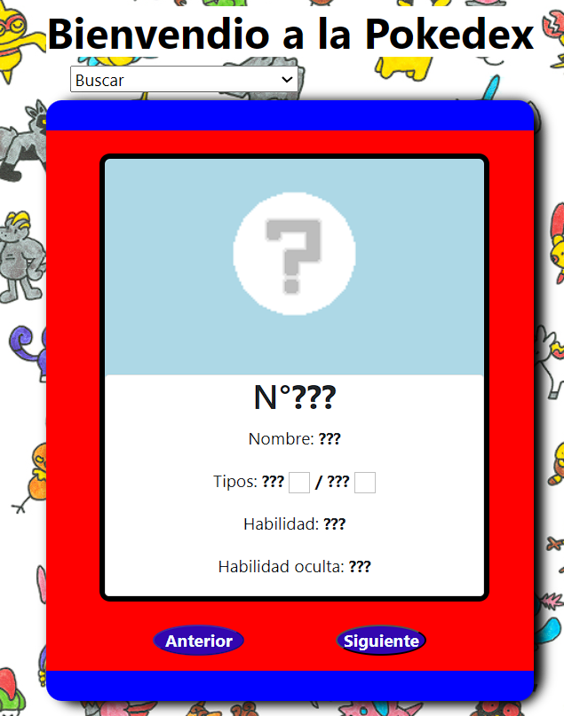
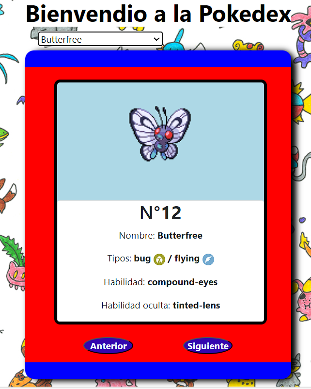

# Pokédex

Bienvenido a la Pokédex, un proyecto inspirado en la famosa enciclopedia de Pokémon. Esta aplicación te permite buscar y visualizar información sobre diferentes Pokémon.


## Descripción

La Pokédex es una aplicación web que proporciona información detallada sobre los Pokémon. Los datos se obtienen desde la PokeApi y se muestran de manera interactiva y amigable para el usuario.

## Características

- Búsqueda de Pokémon por nombre o usando los botones.
- Visualización de las habilidades y tipos de cada Pokémon.
- Interfaz de usuario intuitiva y receptiva.



## Tecnología

- **CSS**: Estilos y presentación visual de la interfaz.
- **bootstrap**: Uso de estilos para la interfaz.
- **HTML**: Estructura de la interfaz.
- **JavaScript**: Lógica de la aplicación y modulación del código.
- **PokeApi**: API utilizada para obtener los datos de los Pokémon.

## Instalación

Sigue estos pasos para instalar y ejecutar el proyecto en tu máquina local:

1. Clona el repositorio:
    ```sh
    git clone https://github.com/andres990420/pokedex.git
    ```

2. Abre el archivo **index.html** usando la extensión de local server y disfruta de la aplicación.

## Créditos

Desarrollado por [andres990420](https://github.com/andres990420).

Créditos a [partywhale](https://github.com/partywhale/pokemon-type-icons) por la creación de los íconos que se usan en este proyecto.

Créditos a [PKMN-AJ](https://www.deviantart.com/pkmn-aj/art/91-Pokemon-1-Paper-30432568) por la imagen usada de fondo de pantalla.